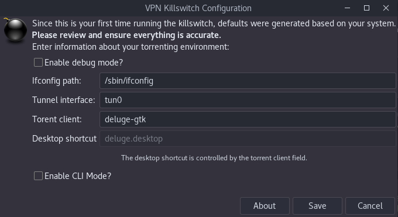

# VPN Killswitch for Torrents on Linux Desktop


When you're torrenting cooking recipes for your grandmother, you deserve your right to privacy.  It isn't your ISPs business what type of cookies she likes to bake.

This script will bind to your torrent application, monitor its existence and terminate it's process if your VPN tunnel is lost.

### GUI and CLI options


### Easily access configuration


CLI:


### How it works
The killswitch overrides the launch of the torrent application and launches it as a subclient, so it can monitor the presence of the VPN tunnel.
The killswitch is able to bind to it, without modifying the torrent app core. (Removal of the .desktop launcher the killswitch modified will restore your original setup.)

*(The desktop launcher version) also prevents the torrent application from even being launched if the VPN is not on.*

### Why not do similar behavior with Iptables, or Deluge's built-in network filter?
In most circumstances, iptables would be the easiest method to bind applications to the desired network interface, but based on my trials, the *desktop gtk* version of Deluge does not play nice with it, so this method is application-based binding to the interface, as an alternative.

If you're using the server version of Deluge, you can probably utilize Iptables or the built-in network filter (Edit > Preferences > Network > enter your tunnel IP in the interface field).

I've only tested the killswitch with Deluge on Gnome desktop on Debian, but it should work with any torrent client in any desktop environment (with basic config adjustments).

This script can also be *easily* modified to work with any application you want to bind to a particular network interface.

## The GUI/graphical user interface version will automatically detect and configure your torrent application to work with the killswitch.

# Compatible operating systems
- GUI version: Debian/Ubuntu-based Linux distros
- CLI version: Any Linux distro; Mac or BSD-based systems may work with minor tweaking, but not tested.

# Install
- Debian / Ubuntu-based distros: use the .deb installer:
```bash
wget https://github.com/angela-d/vpn-killswitch/blob/master/vpn-killswitch.deb?raw=true -O vpn-killswitch.deb
```

- CLI / non-desktop users:
```bash
git clone https://github.com/angela-d/vpn-killswitch.git ~/vpn-killswitch
```

### To run:
- Desktop/GUI: Search for VPN Killswitch on your system to launch the config interface (only needs to be ran once, for initial config, then launch your torrent app as normal).
- CLI (long way): `cd ~/vpn-killswitch/debian/source && ./vpn-check`
- CLI (short way) Make a symbolic link so you can run `vpn-check` from anywhere, without needing to call the full file path or cd into a directory:
```bash
ln -s ~/vpn-killswitch/debian/source/vpn-check /usr/local/bin/vpn-check
```

That's it!   Your torrenting activity is now locked to your VPN.
***


# Thoroughly test this setup before you leave it unattended.
ie. Unplug your ethernet or disable your wifi while it's running, switch off your VPN (doing so you run the risk of exposure, so if possible, set your wifi/ethernet DNS to 127.0.0.1 to loopback, rather than reach your seeders while testing)

Debug may behave differently than non-debug!  Calling the script from the terminal vs a desktop launcher may also behave differently!  *TEST IT*.

 If you encounter bugs or issues, [please submit a bug report](https://notabug.org/angela/vpn-killswitch/issues) detailing the torrent client/application and operating system you're using, as well as:
- Output from `ps aux | grep [torrent client name]`
- and `ps S`
