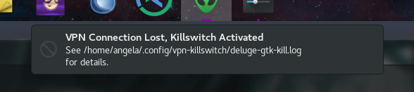
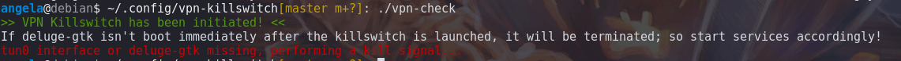

# VPN Killswitch for Torrents on Linux Desktop



When you're torrenting cooking recipes for your grandmother, you deserve your right to privacy.  It isn't your ISPs business what type of cookies she likes to bake.

This script will bind to your torrent application and terminate it's process if your VPN tunnel is lost.



### How it works
It works by (you) replacing the launcher execute command with VPN Killswitch, VPN Killswitch will then launch the torrent client, so it's able to bind to it, without modifying the client core.  *(The desktop launcher version) also prevents the torrent application from even being launched if the VPN is not on.*

### Why not do similar behavior with Iptables, or Deluge's built-in network filter?
In most circumstances, iptables would be the easiest method to bind applications to the desired network interface, but based on my trials, the *desktop gtk* version of Deluge does not play nice with it, so this method is application-based binding to the interface, as an alternative.

If you're using the server version of Deluge, you can probably utilize Iptables or the built-in network filter (Edit > Preferences > Network > enter your tunnel IP in the interface field).

I've only tested the killswitch with Deluge on Gnome desktop on Debian, but it should work with any torrent client in any desktop environment (with basic config adjustments).

This script can also be *easily* modified to work with any application you want to bind to a particular network interface.


## Pre-requisites
* This script will not work in Windows.  Pick a [cooler operating system](https://www.debian.org/distrib/) to use it.  May work in Mac or BSD with minor tweaks needed, but untested.
***
- ifconfig

Check for it's existence in your terminal, by running:
```bash
whereis ifconfig
```
If you don't see a path returned, you'll need to install the net-tools package (this command is for Debian-based Linux systems.  If you're running a different distro/operating system, research what package offers ifconfig and install it):
```bash
apt update && apt install net-tools
```
* We need to know the torrent client's executable

Launch the torrent application and then run the following in your terminal (replace *deluge* for the name of your torrent client -- also take note of the application launcher that the torrent client runs as; in my case, it's *deluge-gtk*):
```bash
ps aux | grep deluge
```
Returns the following output:

> *angela*    2913  0.0  0.0  11176  2988 tty1     S+   05:07   0:00 **deluge-gtk**

For my situation, **deluge-gtk** is my torrent client executable.


***
### Once these requirements are met, you're ready to use the VPN Killswitch.

* Download/clone the **vpn-check** script somewhere.. I put mine in /home/angela/.config/vpn-killswitch/

### Use Git to install the VPN Killswitch to ~/.config
```bash
git clone https://github.com/angela-d/vpn-killswitch.git ~/.config/vpn-killswitch
```

### Bind VPN Killswitch to Your Torrent Application
***
## If using the desktop version of Deluge: the following will force the launcher to bind with the killswitch
This method utilizes the desktop application launcher; which will be different if you're running the torrent client as a headless application.
- See if you have an existing launcher:
```bash
ls -l ~/.local/share/applications
```
Output will look similar to the following, if you have one already:
```bash
-rw-r--r-- 1 angela angela 421 Oct 21 04:34 deluge.desktop
```

If you don't have one, you might be launching your application differently than this script was tested with, so you'll probably have to tweak it a bit to get it binded.

### Open the existing .desktop file for your torrent client
Example command.  As always, adjust the specific path relative to your system:
```bash
pico ~/.local/share/applications/deluge.desktop
```

Look for this line (replace deluge-gtk for your torrent client's executable):
```bash
Exec="deluge-gtk %U"
```

Change that line to point to your VPN Killswitch directory and the validation script:
```bash
Exec=/home/angela/.config/vpn-killswitch/vpn-check %U
```
`%U` allows arguments to be passed, such as URLs for downloads.  If your torrent client accepts magnets and downloads another way, adjust accordingly; as well as adjusting the additional `%U` pass inside `vpn-check` (if necessary).

*If your vpn-killswitch directory wasn't saved to your /home/user/ folder, modify the path in my example to suit your environment.*
***
## Run a cron/standalone (no desktop launcher)
Skip this part if you've set the killswitch to bind to the desktop launcher.

**Don't** set a cron for `* * * *` as there's an infinite loop built in for the duration of the tunnel and client's session.

In the `vpn-check` script, set the CLI variable to true, like so and it will loop forever, so as long as the torrent client *and* the VPN interface remain active:
```bash
CLI=1  # leave 0 if you are using the desktop launcher method
```

In your terminal, navigate to the directory where VPN Killswitch is home to `cd ~/.config/vpn-killswitch` and run:
```bash
./vpn-check
```
to set the validation.  If you want it to run in the background: `./vpn-check &`
***
# Mandatory Config
Before you can use the script, you must modify the config variables to reflect your torrent client.
- Open the vpn-check file and modify the following variables (if necessary):

```bash
IFCONFIG=/sbin/ifconfig   # whereis ifconfig in your terminal will tell you where ifconfig's path is
INTERFACE=tun0            # if you're not sure what your tunnel interface is, run ip a while connected to a vpn.  wlan0 = wifi eth0 = ethernet, etc. (Names will vary by interface type)
CLIENT=deluge-gtk         # the torrent client path exposed in the ps aux command from earlier
```
***
## That's it, you can now torrent without fear of leaking info to seeders or ISPs due to a lost VPN connection!


### Optional Debug Mode
If you want to tweak your VPN Killswitch, you can enable debug mode to get verbose logging and follow the script's movements.
- Open `vpn-check`
- Change `DEBUG=0` to `DEBUG=1`
- Launch your torrent application
- View log output at `/your/vpn-killswitch/destination/[your torrent-client]-kill.log` ie. mine is at: `/home/angela/.config/vpn-killswitch/deluge-gtk-kill.log`

To view live log output content, `tail -f` as `tail -f/home/angela/.config/vpn-killswitch/deluge-gtk-kill.log`

*Be sure to disable debug mode when you're done with it, or you'll find the log rapidly eating space on your hard drive!*


**In normal (non-debug) mode, torrent client terminations initiated by VPN killswitch are always logged to `/your/directory/vpn-killswitch/[your torrent-client]-kill.log`.**


# Thoroughly test this setup before you leave it unattended.
ie. Unplug your ethernet or disable your wifi while it's running, switch off your VPN (doing so you run the risk of exposure, so if possible, set your wifi/ethernet DNS to 127.0.0.1 to loopback, rather than reach your seeders while testing)

Debug may behave differently than non-debug!  Calling the script from the terminal vs a desktop launcher may also behave differently!  *TEST IT*.

 If you encounter bugs or issues, [please submit a bug report](https://notabug.org/angela/vpn-killswitch/issues) detailing the torrent client/application and operating system you're using, as well as:
- Output from `ps aux | grep [torrent client name]`
- and `ps S`
